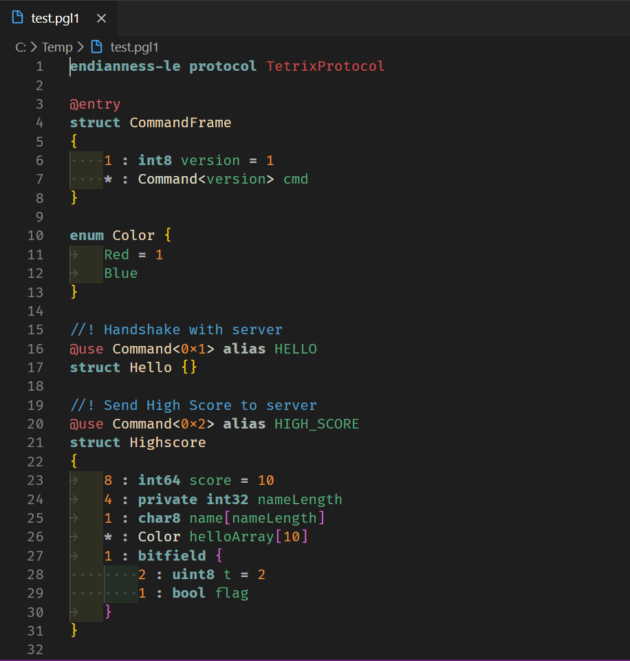

# PGL1 For Visual Studio Code

This extension provides support for the Protocol Definition Language (PGL) used by [Protlr](https://www.protlr.com) in [Visual Studio Code](https://code.visualstudio.com).

## Features

* Syntax Highlighting

## Contributing

Bug reports and pull requests are welcome on GitHub at https://github.com/protlr/vscode-language-pgl1. 
This project is intended to be a safe, welcoming space for collaboration, and contributors are expected to adhere to 
the [code of conduct](https://github.com/protlr/vscode-language-pgl1/blob/master/CODE_OF_CONDUCT.md).

## License

This extension is released under the terms of the [MIT License](https://opensource.org/licenses/MIT).

**Cheers!**
